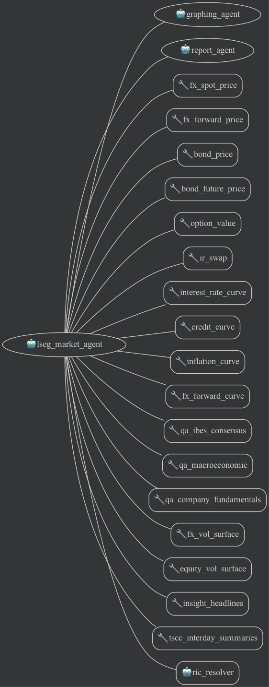

# LSEG & Google ADK Market Intelligence Demo

This project is a demonstration of a multi-agent system built with the **Google Agent Development Kit (ADK)** seamlessly orchestrating the **LSEG Model Context Protocol (MCP)** server. The resulting **Cross-Asset Market Intelligence & Valuation Agent** showcases how a team of specialized Large Language Models (LLMs)—including a root orchestrator, a Python-enabled graphing agent, and a reporting agent—can collaboratively reason over live institutional financial data, pricing logic, and news sentiment.

---

## 🏗️ Architecture

The architecture illustrates a powerful synergy between the Google ADK and LSEG's specialized financial APIs bridged via standard MCP:



1. **Multi-Agent Orchestration (Google ADK)**: The system is structured using a multi-agent framework:
   - **Root Orchestrator (`lseg_market_agent`)**: Acts as the cognitive orchestration engine. It autonomously queries the LSEG tools, tracks context, and delegates tasks to sub-agents.
   - **Graphing Sub-Agent (`graphing_agent`)**: Equipped with a Python Code Execution environment (`BuiltInCodeExecutor`) to dynamically generate financial plots, candlestick charts, and visualizations from the data retrieved by the orchestrator.
   - **Report Writer Sub-Agent (`report_agent`)**: Synthesizes all gathered financial data, news sentiment, and visual inferences into a final, comprehensive, and professional Markdown report.
2. **MCP HTTP Client Bridge**: Rather than using standard I/O (stdio) proxy executables, this application natively binds to the LSEG HTTP MCP endpoint `https://api.analytics.lseg.com/lfa/mcp` using ADK's `StreamableHTTPConnectionParams`.
3. **LSEG Authentication**: Handled automatically in Python by `mcp_client_bridge.py`, fetching an ephemeral JWT token via OAuth2 client-credentials logic to secure the MCP communication seamlessly.
4. **Tool Discovery & Routing**: ADK maps the structured JSON-schemas from the LSEG MCP discovery phase into the LLM's function-calling toolset allowing the LLM to autonomously retrieve required market data to answer ambiguous questions.

---

## 🛠️ LSEG MCP Tools Available

The agent has access to **17 specialized financial tools** served by the LSEG MCP server. It decides autonomously which tools to combine based on the user's prompt:

### Pricing & Valuation Tools
*   `fx_spot_price`: Calculates FX spot pricing, valuation, and analytics (e.g., EUR/USD).
*   `fx_forward_price`: Calculates FX forward pricing and analytics.
*   `bond_price`: Prices corporate and sovereign bonds via identifiers (ISIN, CUSIP, RIC).
*   `bond_future_price`: Prices bond futures via instrument code.
*   `option_value`: Values vanilla, exotic barrier, and binary options with Greeks (Delta, Gamma, Vega).
*   `ir_swap`: Prices Interest Rate Swaps based on customizable reference templates.

### Market Data Curves & Surfaces
*   `interest_rate_curve`: Fetches available IR curves and calculates curve points.
*   `credit_curve`: Generates and retrieves corporate and sovereign credit curves.
*   `inflation_curve`: Searches and calculates inflation curves by country.
*   `fx_forward_curve`: Calculates FX Forward curves.
*   `fx_vol_surface`: Generates FX Volatility surfaces.
*   `equity_vol_surface`: Generates Equity Volatility surfaces.

### Quantitative Analytics (QA) & Fundamentals
*   `qa_company_fundamentals`: Retrieves deep historical financials (Net Sales, Gross Income, EPS, DPS, P/E Ratio).
*   `qa_ibes_consensus`: Provides forward-looking IBES Analyst Consensus metrics.
*   `qa_macroeconomic`: Global economic indicator database (GDP, CPI, Unemployment, Non-Farm Payrolls).

### News & Time Series
*   `insight_headlines`: Ingests and aggregates the latest news and sentiment for specific companies (RICs) or topics.
*   `tscc_interday_summaries`: Consolidates multi-frequency interday pricing summaries (time series data).

---

## 🚀 Setup & Installation

**Prerequisites:** 
- Python 3.12+
- LSEG Workspace / Developer Portal API credentials
- Google Cloud CLI (`gcloud`) for Vertex AI access

1. It is recommended to create a virtual environment first:
   ```bash
   python3.12 -m venv venv
   source venv/bin/activate
   ```
2. Install dependencies:
   ```bash
   pip install google-adk python-dotenv requests
   ```
3. Clone this repository locally.

### Authentication & Configuration

First, authenticate your local environment with Google Cloud so the ADK can access Gemini via Vertex AI:
```bash
gcloud auth application-default login
```

Set up your `.env` file with your Google Cloud Project ID and LSEG MCP Service Account credentials (generated via the LSEG Workspace / Developer Portal Service Accounts tab):
```bash
cp .env.example .env
```
Inside `.env`, provide:
```env
# Google Cloud Vertex AI
GOOGLE_CLOUD_PROJECT="YOUR_GOOGLE_CLOUD_PROJECT_ID"
GOOGLE_GENAI_USE_VERTEXAI="true"

# LSEG MCP Service Account
LSEG_CLIENT_ID="GE-XX-XXXXXX"
LSEG_CLIENT_SECRET="XXXXX-XXXX-XXXX-XXXXX"
```

### Running the Agent

You can interact with the agent natively via the built-in CLI Runner, or spin it up locally in a browser using the `adk web` utility.

#### Method 1: CLI Runner
Execute the runner directly from standard out using a prompt override:
```bash
python3.12 run.py --prompt "Compare Apple's latest fundamentals with recent news sentiment."
```

#### Method 2: ADK Web Interface
Because the application is structured with a root package `lseg_market_agent`, you can spin up the full ADK Gradio UI natively to chat interactively with the agent:
```bash
adk web .
```

#### Method 3: Deploy to Vertex AI Agent Engine
You can deploy this agent to Google Cloud's Vertex AI Agent Engine using the standalone ADK CLI. This will package the agent and deploy it to your GCP project as a managed service. *(Ensure you have run `gcloud auth application-default login` and have the Vertex AI API enabled for your project)*:
```bash
adk deploy agent_engine --project="YOUR_PROJECT_ID" --region="us-central1" --display_name="LSEG Market Agent" lseg_market_agent
```
Once deployed, you can run and interact with the remote agent directly via Google Cloud or by using the ADK runtime. To run it from the CLI, obtain your Reasoning Engine ID from the deployment output and run:
```bash
adk run lseg_market_agent --session_service_uri "agentengine://<YOUR_REASONING_ENGINE_ID>"
```

---

## 🧪 Comprehensive Testing Queries

The real power of this integration is the LLM's ability to orchestrate multi-modal tool requests. Paste any of these queries into the CLI or the ADK Web interface to test the agent's capabilities:

### **Level 1: Focused Data Retrieval**
*   **Company Fundamentals**: *"What was Microsoft's (MSFT.O) Gross Income and EPS for 2022 and 2023?"*
*   **Macroeconomic Data**: *"Show me the latest US GDP and Unemployment figures (search for the Mnemonics if you don't know them)."*
*   **News & Sentiment**: *"Get me the latest insight headlines specifically mentioning Tesla (TSLA.O)."*
*   **Forward Consensus**: *"Fetch the year-over-year forward analyst earnings expectations for Amazon (RIC=AMZN.O) through 2027."*

### **Level 2: Cross-Asset Market Intelligence**
*   *"Analyze Apple's (AAPL.O) recent financial fundamentals, check the latest news sentiment around it, and fetch analyst consensus estimates for the next year to provide a complete investment summary."*
*   *"How is the recent Spanish macroeconomic trajectory (CPI and GDP) affecting the construction sector? Get the latest macro stats and cross-index it with news headlines about Spanish Real Estate or Construction."*

### **Level 3: Pricing & Math Reasoning**
*   *"Price a vanilla European Call Option for Apple (AAPL.O) expiring on December 31, 2025. Set the strike at $200. What is the Delta and Vega? Note: You may need to guess current standard market parameters."*
*   *"I want to execute a €5,000,000 FX Spot trade between EUR and USD. Price the EURUSD cross, then price a 6-month EURUSD FX Forward and compare the implied swap points."*
*   *"Can you list the available US Treasury interest rate curves? Pick the most standard one to calculate curve points for."*

### **Level 4: Complex Synthesis & Multi-Agent Delegation**
The orchestrator can delegate specialized tasks—such as dynamically generating Python visualizations and formatting Markdown—to its sub-agents to provide a visually compelling, presentation-ready output.
*   **Bar Charts & Synthesis**: *"Fetch the historical EPS and Revenue for Amazon over the last 3 years. Draw a grouped bar chart of the EPS vs Revenue data. Then write a final report summarizing the trends."* 
*   **Trend Lines & Moving Averages**: *"Retrieve Microsoft's interday stock price summary for the last month. Plot the closing prices as a line chart with a 5-day moving average overlaid. Transfer to the report agent for an executive summary."*
*   **Candlestick Charts**: *"Get the recent daily price action for Tesla (TSLA.O). Instruct the graphing agent to render this as a candlestick chart showing the open, high, low, and close prices, and format the visual beautifully."*
*   **Multi-Metric Scatter Plots**: *"Gather the forward P/E ratios and Dividend Yields for Apple, Microsoft, and Google based on consensus estimates. Create a scatter plot visualizing this relationship with labels for each company, then write a short thesis."*
*   **Full Executive Thesis**: *"Act as an institutional portfolio manager. Evaluate Vodafone (VOD.L). Retrieve its historical fundamentals (2020-2023), its forward analyst consensus estimates (2024-2026), its latest news trends, and recent stock price trajectory. Graph the stock trajectory and assemble everything into an executive thesis."*
