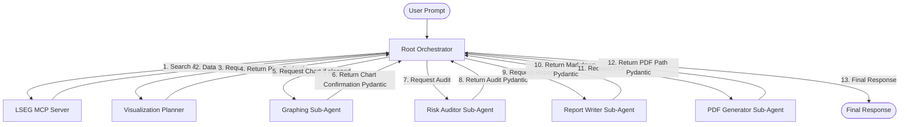

# LSEG & Google ADK Market Intelligence Demo

This project is a demonstration of a multi-agent system built with the **Google Agent Development Kit (ADK)** seamlessly orchestrating the **LSEG Model Context Protocol (MCP)** server. The resulting **Cross-Asset Market Intelligence & Valuation Agent** showcases how a team of specialized Large Language Models (LLMs)—including a root orchestrator, a Python-enabled graphing agent, and a reporting agent—can collaboratively reason over live institutional financial data, pricing logic, and news sentiment.

---

## 🏗️ Architecture

The architecture illustrates a powerful synergy between the Google ADK and LSEG's specialized financial APIs bridged via standard MCP:


1. **Multi-Agent Orchestration (Google ADK)**: The system is structured using a multi-agent framework:
   - **Root Orchestrator (`lseg_market_agent`)**: Acts as the cognitive orchestration engine. It autonomously queries the LSEG tools, tracks context, and manages the execution flow of the sub-agents sequentially.
   - **Visualization Planner (`visualization_planner_agent`)**: Analyzes the gathered data and news context to determine if any visualizations (charts) would help explain trends, divergences, or risks, and outputs a structured Pydantic plan.
   - **Graphing Sub-Agent (`graphing_agent`)**: Equipped with a Python Code Execution environment (`BuiltInCodeExecutor`) to dynamically generate financial plots based on the plan from the visualization planner.
   - **Risk Auditor Sub-Agent (`risk_critic_agent`)**: Critiques the gathered financial analysis for over-optimism, evaluates downside risks, and suggests hedging notes, returning a structured Pydantic schema.
   - **Report Writer Sub-Agent (`report_agent`)**: Synthesizes all gathered data, risk audits, and visual inferences into a final, comprehensive, and professional Markdown report.
   - **PDF Generator Sub-Agent (`pdf_generator_agent`)**: Compiles the final Markdown report and any visual plots into a professional, downloadable PDF artifact.

2. **MCP HTTP Client Bridge**: Rather than using standard I/O (stdio) proxy executables, this application natively binds to the LSEG HTTP MCP endpoint `https://api.analytics.lseg.com/lfa/mcp` using ADK's `StreamableHTTPConnectionParams`.
3. **LSEG Authentication**: Handled automatically in Python by `mcp_client_bridge.py`, fetching an ephemeral JWT token via OAuth2 client-credentials logic to secure the MCP communication seamlessly.
4. **Tool Discovery & Routing**: ADK maps the structured JSON-schemas from the LSEG MCP discovery phase into the LLM's function-calling toolset allowing the LLM to autonomously retrieve required market data to answer ambiguous questions.

## 🔄 Multi-Agent Workflow & Interaction

The system takes a pipelined, cascaded approach to answering complex financial analysis queries. The flow of custody ensures that data gathering, visual rendering, compliance auditing, and reporting are executed in a strict, audited sequence:



### Key Interaction Mechanisms:
1. **Sequential Orchestration**: The Root Orchestrator manages the pipeline sequentially using ADK 2.0 Task Mode. Instead of dynamic routing via `transfer_to_agent`, control always returns to the Orchestrator. Sub-agents execute their specific tasks and call `finish_task` to return structured Pydantic outputs.
2. **Structured Communication**: All sub-agents communicate using rigid, predefined Pydantic schemas (e.g., `VisualizationPlanOutput`, `GraphingOutput`, `RiskCriticOutput`). This ensures type safety and predictable data structures between steps.
3. **Formal Visualization Planning**: A dedicated `visualization_planner_agent` decides whether charts are needed and outlines the specifications (types, axes, annotations) before the graphing agent generates them.
4. **Draft Audit Compliance**: The final report is compiled by the `report_agent` only after the `risk_critic_agent` has returned a structured risk audit, ensuring compliance notes are never bypassed.

---

## 🛠️ LSEG MCP Tools Available

The agent has access to the complete suite of **37 specialized financial tools** served by the LSEG MCP server. It decides autonomously which tools to combine based on the user's prompt:

### 1. Equity Research Tools
*   `qa_company_fundamentals`: Retrieves deep historical financials (Net Sales, Gross Income, EPS, DPS, P/E Ratio).
*   `qa_ibes_consensus`: Provides forward-looking IBES Analyst Consensus metrics (EPS, Revenue, Dividends forecasts).
*   `insight_headlines` / `important_company_news`: Ingests and aggregates the latest news and sentiment for specific companies or topics.
*   `historical_pricing_summaries`: Consolidates multi-frequency historical pricing summaries (time series data).
*   `option_value`: Values vanilla, exotic barrier, and binary options with Greeks (Delta, Gamma, Vega, Theta, Rho).
*   `equity_vol_surface`: Generates Equity Volatility surfaces.

### 2. Fixed Income & Credit Auditing Tools
*   `fixed_income_bond_reference`: Fetches issuer and bond reference metadata.
*   `fixed_income_risk_analytics`: Computes duration, convexity, and option-adjusted spread (OAS) risk analytics.
*   `interest_rate_curve`: Fetches available IR curves and calculates curve points.
*   `inflation_curve`: Searches and calculates inflation curves by country.
*   `credit_curve` / `bond_price`: Generates and retrieves credit curves and prices corporate/sovereign bonds.

### 3. FX & Currency Hedging Tools
*   `fx_spot_price`: Calculates FX spot pricing and analytics.
*   `fx_forward_price` / `fx_forward_curve`: Calculates FX forward pricing, swap points, and forward curves.
*   `fx_event_tracker`: Tracks historical event volatility around macroeconomic event dates.
*   `fx_vol_surface`: Generates FX Volatility surfaces.

### 4. FTSE Index Benchmarking (IXM) Tools
*   `ixm_list_indexes`: Index listing and discovery to find index benchmarks.
*   `ixm_compare_index_return_time_series`: Compares return profiles across multiple indices over time.
*   `ixm_index_risk_time_series`: Analyzes index risk timeseries (volatility, tracking error).
*   `ixm_index_sector_risk`: Returns index sector risk breakdowns.

### 5. Macroeconomic Analysis
*   `qa_macroeconomic`: Global economic indicator database (GDP, CPI, Unemployment, Non-Farm Payrolls).

---

## 🚀 Setup & Installation

**Prerequisites:** 
- Python 3.12+
- LSEG Workspace / Developer Portal API credentials
- Google Cloud CLI (`gcloud`) for Vertex AI access

1. It is recommended to create a virtual environment first:
   ```bash
   python3.12 -m venv venv
   source venv/bin/activate
   ```
2. Install dependencies:
   ```bash
   pip install -r requirements.txt
   ```
3. Clone this repository locally.

### Authentication & Configuration

First, authenticate your local environment with Google Cloud so the ADK can access Gemini via Vertex AI:
```bash
gcloud auth application-default login
```

Set up your `.env` file with your Google Cloud Project ID and LSEG MCP Service Account credentials (generated via the LSEG Workspace / Developer Portal Service Accounts tab):
```bash
cp .env.example .env
```
Inside `.env`, provide:
```env
# Google Cloud Vertex AI
GOOGLE_CLOUD_PROJECT="YOUR_GOOGLE_CLOUD_PROJECT_ID"
GOOGLE_GENAI_USE_VERTEXAI="true"

# LSEG MCP Service Account
LSEG_CLIENT_ID="GE-XX-XXXXXX"
LSEG_CLIENT_SECRET="XXXXX-XXXX-XXXX-XXXXX"
```

### Running the Agent

You can interact with the agent natively via the built-in CLI Runner, or spin it up locally in a browser using the `agents-cli playground` utility.

#### Method 1: CLI Runner
Execute the runner directly from standard out using a prompt override:
```bash
python3 run.py --prompt "Compare Apple's latest fundamentals with recent news sentiment."
```

#### Method 2: Local Web Playground
Because the application is structured with a root package `lseg_market_agent`, you can spin up the full web playground interface to chat interactively with the agent:
```bash
agents-cli playground
```

#### Method 3: Deploy to Vertex AI Agent Engine (Agent Runtime)
You can deploy this agent to Google Cloud's Agent Runtime using the standalone `agents-cli` tool. This will package the agent and deploy it to your GCP project as a managed service:
```bash
agents-cli deploy --project="YOUR_PROJECT_ID" --region="us-central1"
```
Once deployed, you can run and interact with the remote agent directly via the CLI:
```bash
agents-cli run "Compare Apple's latest fundamentals with recent news sentiment."
```

---

## 🧪 Comprehensive Testing Queries

The real power of this integration is the LLM's ability to orchestrate multi-modal tool requests. Paste any of these queries into the CLI or the ADK Web interface to test the agent's capabilities:

### **Level 1: Focused Data Retrieval**
*   **Company Fundamentals**: *"What was Microsoft's (MSFT.O) Gross Income and EPS for 2022 and 2023?"*
*   **Macroeconomic Data**: *"Show me the latest US GDP and Unemployment figures (search for the Mnemonics if you don't know them)."*
*   **News & Sentiment**: *"Get me the latest insight headlines specifically mentioning Tesla (TSLA.O)."*
*   **Forward Consensus**: *"Fetch the year-over-year forward analyst earnings expectations for Amazon (RIC=AMZN.O) through 2027."*

### **Level 2: Cross-Asset Market Intelligence**
*   *"Analyze Apple's (AAPL.O) recent financial fundamentals, check the latest news sentiment around it, and fetch analyst consensus estimates for the next year to provide a complete investment summary."*
*   *"How is the recent Spanish macroeconomic trajectory (CPI and GDP) affecting the construction sector? Get the latest macro stats and cross-index it with news headlines about Spanish Real Estate or Construction."*

### **Level 3: Pricing & Math Reasoning**
*   *"Price a vanilla European Call Option for Apple (AAPL.O) expiring on December 31, 2025. Set the strike at $200. What is the Delta and Vega? Note: You may need to guess current standard market parameters."*
*   *"I want to execute a €5,000,000 FX Spot trade between EUR and USD. Price the EURUSD cross, then price a 6-month EURUSD FX Forward and compare the implied swap points."*
*   *"Can you list the available US Treasury interest rate curves? Pick the most standard one to calculate curve points for."*
*   **Credit & Bond Valuation**: *"For a high-leverage company like AT&T (T), inspect its corporate debt rating or credit curves to formulate an overlay regarding credit leverage health and yield spread."*
*   **Volatility Surface Assessment**: *"Fetch the equity volatility surface for Microsoft (MSFT.O). Retrieve implied volatility gradients to determine market expectations for short-term downside risks (skew profile)."*

### **Level 4: Complex Synthesis & Multi-Agent Delegation**

The orchestrator can delegate specialized tasks—such as dynamically generating Python visualizations and formatting Markdown—to its sub-agents to provide a visually compelling, presentation-ready output.
*   **Bar Charts & Synthesis**: *"Fetch the historical EPS and Revenue for Amazon over the last 3 years. Draw a grouped bar chart of the EPS vs Revenue data. Then write a final report summarizing the trends."* 
*   **Trend Lines & Moving Averages**: *"Retrieve Microsoft's interday stock price summary for the last month. Plot the closing prices as a line chart with a 5-day moving average overlaid. Transfer to the report agent for an executive summary."*
*   **Candlestick Charts**: *"Get the recent daily price action for Tesla (TSLA.O). Instruct the graphing agent to render this as a candlestick chart showing the open, high, low, and close prices, and format the visual beautifully."*
*   **Multi-Metric Scatter Plots**: *"Gather the forward P/E ratios and Dividend Yields for Apple, Microsoft, and Google based on consensus estimates. Create a scatter plot visualizing this relationship with labels for each company, then write a short thesis."*
*   **Full Executive Thesis**: *"Act as an institutional portfolio manager. Evaluate Vodafone (VOD.L). Retrieve its historical fundamentals (2020-2023), its forward analyst consensus estimates (2024-2026), its latest news trends, and recent stock price trajectory. Graph the stock trajectory and assemble everything into an executive thesis."*
*   **PDF Report Evaluation**: *"Run a complete analysis for Microsoft (MSFT.O) including growth metrics and news sentiment. Explicitly trigger the PDF generator step to produce a downloadable PDF file summarizing everything."*

---

## 📊 Automated Evaluations (ADK Evals)

The project includes an automated evaluation suite powered by the Google ADK's `agents-cli eval`. This allows you to verify that the agent is calling the correct tools and succeeding in multi-turn tasks.

### 🔍 What is There?
Evaluation datasets and configurations are stored in the `tests/eval/` directory:
- **`tests/eval/eval_config.yaml`**: Configures the evaluation metrics to run (`multi_turn_task_success`, `multi_turn_tool_use_quality`, and a custom code-based metric `tool_use_subset_match`).
- **`tests/eval/datasets/`**: Contains the JSON-based test cases (e.g., `lseg_market_evals.json`, `case_1_msft.json`, `case_2_gdp.json`). Each test case defines:
  - **`prompt`**: The starting user query.
  - **`expected_tools`**: The list of tools the agent must call to resolve the query.

### ⚙️ How It Works
The evaluation system:
1. Runs the agent locally.
2. Executes the user prompts in the dataset.
3. Grades the agent's actual trajectories and tool calls against the metrics defined in `eval_config.yaml`.
4. Outputs detailed metrics scores.

### 🏃 How to Run Evals
To execute the evaluation suite, run:
```bash
agents-cli eval run
```

Or target a specific dataset file:
```bash
agents-cli eval run --dataset tests/eval/datasets/case_1_msft.json
```

Output results will look similar to:
```text
Evaluation Run Summary:
Metrics to run: ['multi_turn_task_success', 'multi_turn_tool_use_quality', 'tool_use_subset_match']

Running evaluations on tests/eval/datasets/case_1_msft.json...
  - Case #1: Success (1.0), Tool Quality (1.0), Tool Subset Match (1.0)
...
```
