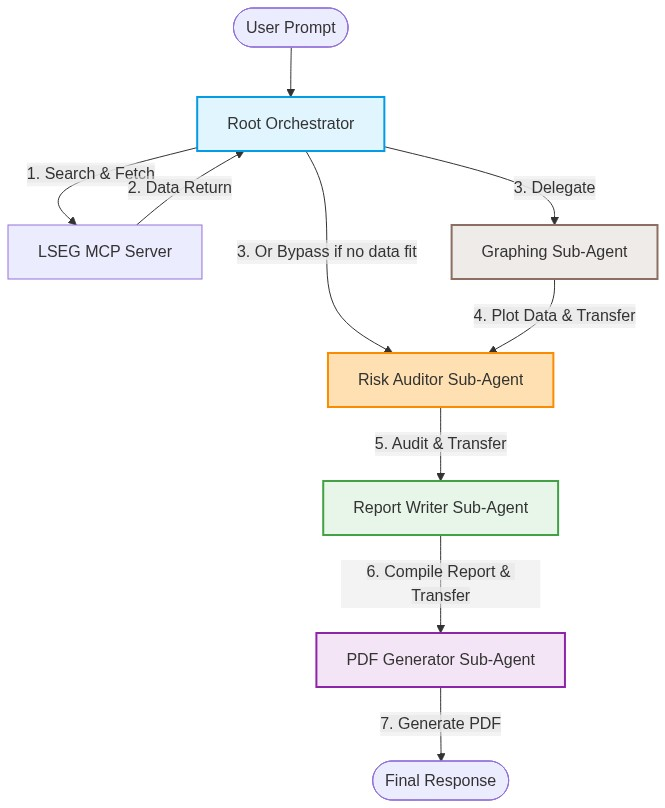
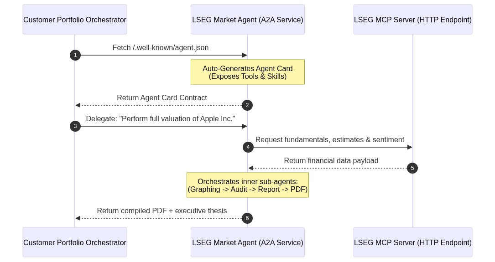

# Bridging Institutional Data with Collaborative AI: The LSEG & Google ADK Market Intelligence Agent

Modern financial markets move at a breakneck pace. As an equity analyst, portfolio manager, or corporate treasurer, answering a single complex question—such as assessing a company's health and formulating a risk-hedged investment thesis—requires hours of fragmented research. You must pull historical balance sheets, extract analyst consensus targets, analyze the latest news sentiment, map volatility curves, generate visualizations, audit the data for compliance, and finally compile everything into an executive-ready report.

What if a collaborative team of specialized AI agents could do all this for you in a matter of seconds, with access to real-time institutional-grade data?

Today, we are introducing the **Cross-Asset Market Intelligence & Valuation Agent**, a state-of-the-art multi-agent system built on the **Google Agent Development Kit (ADK)** and powered by **LSEG's Model Context Protocol (MCP)** server. This project showcases the next generation of AI-driven financial reasoning, combining deep quantitative metrics with institutional compliance and automated executive publishing.

---

## 🏗️ The Architectural Blueprint: Collaborative Multi-Agent AI

At the heart of this project is a **collaborative multi-agent framework** managed by the Google ADK. Instead of relying on a single large language model (LLM) to handle data gathering, math reasoning, chart rendering, and writing, we orchestrate a team of five specialized agents, each with a distinct role, clear operational constraints, and a strict **Chain of Custody**.



Let's look at the specialized roles that form this elite team:

### 1. The Root Orchestrator (`lseg_market_agent`)
The Orchestrator is the cognitive engine of the pipeline. When a user submits a query, the Orchestrator:
- Resolves ambiguous company names to official stock RIC (Reuters Instrument Code) symbols using a dedicated Google Search sub-agent (`ric_resolver`).
- Autonomously selects and queries the necessary LSEG MCP tools (requiring at least three tools, such as fundamentals, consensus, and news, to build rich context).
- Tracks conversation context and decides which sub-agent to delegate to next.

### 2. The Python Graphing Sub-Agent (`graphing_agent`)
Equipped with a secure, sandboxed **Python Code Execution environment** (`BuiltInCodeExecutor`), this agent dynamically writes and runs Python scripts (using libraries like `matplotlib`, `pandas`, or `mplfinance`) to plot financial data. It is capable of generating grouped bar charts for fundamentals, line charts for trend lines and moving averages, and high-fidelity candlestick charts for interday price action.

### 3. The Risk Auditor Sub-Agent (`risk_critic_agent`)
Compliance and risk management are paramount in finance. The Risk Auditor critiques the gathered financial data, looking strictly for:
- **Downside Risks**: Missed macroeconomic headwinds (e.g., inflation, rate hikes) or company-specific deceleration.
- **Over-optimism**: Forward consensus and headlines that appear overly bullish relative to historical hard metrics.
- **Risk Mitigation**: Practical hedging strategies (e.g., protective puts or options overlays) to protect positions.

### 4. The Report Writer Sub-Agent (`report_agent`)
The Report Writer acts as an elite institutional equity research analyst. It synthesizes raw financial tables, sentiment data, visual inferences, and the compliance audit into a comprehensive, structured Markdown document in the style of top-tier investment bank reports.

### 5. The PDF Generator Sub-Agent (`pdf_generator_agent`)
The final touch. This agent uses a custom Python FPDF implementation to programmatically parse the report markdown and cleanly append any generated visualization PNGs into a beautiful, downloadable PDF report.

---

## 🔌 Under the Hood: Natively Bridging LSEG MCP & Google ADK

A key technical highlight of this demonstration is its integration mechanism. Rather than spinning up standard stdio (command-line subprocess) proxies for the LSEG MCP server, the system natively binds to LSEG's remote HTTP MCP endpoint:

```python
# Natively creating the authenticated MCP connection using ADK
def create_lseg_mcp_toolset() -> MCPToolset:
    return MCPToolset(
        connection_params=StreamableHTTPConnectionParams(
            url="https://api.analytics.lseg.com/lfa/mcp",
            headers={},
            timeout=180.0
        ),
        header_provider=lseg_header_provider
    )
```

### Secure JWT Authentication & Auto-Refresh
Financial institutional data must be secure. The client bridge (`mcp_client_bridge.py`) automatically handles LSEG OAuth2 client-credentials logic, securely caching and dynamically refreshing ephemeral JWT tokens in the background via the dynamic `header_provider`.

### Schema-Adaptive Runtime Discovery
During initialization, the ADK automatically reads the structured JSON schemas exposed by the LSEG MCP discovery phase. It maps these schemas into standard function-calling tools for the LLM. This allows the Root Orchestrator to autonomously "discover" and execute any of the **37 specialized LSEG tools** available, ranging from options pricing and curves to fundamental databases:

- **Equity Research**: `qa_company_fundamentals`, `qa_ibes_consensus`, `insight_headlines` / `important_company_news`, `historical_pricing_summaries`, `option_value`, `equity_vol_surface`.
- **Fixed Income & Credit Audits**: `fixed_income_bond_reference`, `fixed_income_risk_analytics`, `interest_rate_curve`, `inflation_curve`, `credit_curve` / `bond_price`.
- **FX & Currency Hedging**: `fx_spot_price`, `fx_forward_curve` / `fx_forward_price`, `fx_event_tracker`, `fx_vol_surface`.
- **FTSE Index Benchmarking (IXM)**: `ixm_list_indexes`, `ixm_compare_index_return_time_series`, `ixm_index_risk_time_series`, `ixm_index_sector_risk`.
- **Macroeconomic Analysis**: `qa_macroeconomic`.

---

## 💡 Key Benefits & Unique Features

This collaborative multi-agent system introduces several unique behaviors that set it apart from standard single-turn LLM implementations:

### 📊 Proactive Visualization
Even if the user **does not** explicitly ask for a chart, the Root Orchestrator analyzes the quantitative data it retrieves (e.g., timeseries closing prices, or forward EPS estimates). If it determines that a visualization will make the report more impactful, it proactively calls the `graphing_agent` to plot the data before advancing the workflow.

### 🛡️ Audit Before Authoring (Chain of Custody)
The Report Writer is physically barred from generating a report before a formal risk audit is completed. If numerical data is compiled, the Orchestrator routes execution through the `risk_critic_agent` first, ensuring that potential over-optimism and downside risks are formally integrated as a core section of the final report.

### ⚡ Production-Ready Deployment
Because the agents are packaged using standard ADK `App` definitions, they are instantly deployable across three runtime modes:
1.  **CLI Mode**: Execute targeted prompts straight from standard output.
2.  **Local Web Playground**: Launch the local web playground interface by running `agents-cli playground`.
3.  **Vertex AI Agent Engine**: Deploy the multi-agent application with a single command (`agents-cli deploy`) to Google Cloud as a fully managed, scalable Reasoning Engine.

---

## 🔗 Enterprise Integration: Connecting via Agent-to-Agent (A2A)

In modern enterprise architectures, data and AI capabilities should not exist in silos. While local multi-agent coordination (in-memory orchestration) is perfect for structured pipelines, institutional environments demand that these capabilities be exposed as reusable, secure network utilities.

The **Google ADK's Agent-to-Agent (A2A) protocol** provides a standardized way for independent agents to communicate and collaborate across network, cloud, and organizational boundaries—even if they are written in different languages or managed by separate teams.



### 1. Exposing the LSEG Market Agent to the Ecosystem
Exposing our LSEG agent as a remote service is remarkably simple. Using ADK's `to_a2a` utility, we can wrap the `root_agent` and spin up a Starlette web application served via `uvicorn`:

```python
from google.adk.a2a.utils.agent_to_a2a import to_a2a
from lseg_market_agent.agent import root_agent

# Wrap the root agent into an A2A compliant web service
a2a_app = to_a2a(root_agent, port=8001)
```

When you host this service (e.g., in a secure container on Google Cloud Run), it automatically publishes an **Agent Card** at the `/.well-known/agent.json` endpoint. The Agent Card is a formal, machine-readable contract that exposes the agent's capabilities, specialized skills, and tools to the rest of the corporate network.

### 2. Consuming the LSEG Agent from Customer Ecosystems
A customer's internal agent (for example, an Automated Underwriting Agent, a Portfolio Rebalancing Bot, or an M&A Compliance Orchestrator) can now consume the LSEG Market Agent natively over the network. 

Using the ADK's `RemoteA2aAgent` proxy class, the customer's system treats our LSEG agent as if it were a local tool:

```python
from google.adk.agents import RemoteA2aAgent, LlmAgent

# 1. Bind to the LSEG Market Agent over the network via its Agent Card
lseg_remote_service = RemoteA2aAgent(
    name="lseg_market_intelligence",
    agent_card_url="https://lseg-agent-service.internal/.well-known/agent.json"
)

# 2. Register it as a specialized sub-agent inside the customer's internal system
customer_portfolio_agent = LlmAgent(
    name="portfolio_orchestration_agent",
    instruction="Evaluate holdings. For deep asset research, delegate to lseg_market_intelligence.",
    sub_agents=[lseg_remote_service]
)
```

### 3. Why A2A is a Game-Changer for Customers
By integrating via A2A, the LSEG Market Agent becomes an active, real-time participant in the customer's broader data ecosystem:
*   **Zero-Trust Security & Governance**: Enforce Row-Level Security and Model Armor policies at the boundaries. The customer's agent only has access to the specific tools and capabilities defined in the LSEG Agent Card contract.
*   **Decoupled Architecture**: The customer's team can build their core business logic in their preferred framework (even non-Python systems), while offloading complex quantitative valuations to the dedicated LSEG A2A microservice.
*   **Continuous Context Handoffs**: A2A enables seamless exchange of rich, multi-modal context (such as feeding internal compliance logs directly into our agent, and receiving structured PDFs and charts back).

---

## 🚀 Getting Started in Minutes

Anxious to see it in action? You can set up and run this market intelligence agent locally in just a few steps.

### 1. Clone and Install Dependencies
Ensure you have Python 3.12+ and virtual environment tools installed:
```bash
python3 -m venv venv
source venv/bin/activate
pip install -r requirements.txt
```

### 2. Authenticate and Configure Environment
Authenticate your local environment with Google Cloud to allow ADK access to Vertex AI:
```bash
gcloud auth application-default login
```
Copy `.env.example` to `.env` and fill in your GCP Project ID and LSEG MCP credentials:
```env
GOOGLE_CLOUD_PROJECT="YOUR_PROJECT_ID"
GOOGLE_GENAI_USE_VERTEXAI="true"
LSEG_CLIENT_ID="GE-XX-XXXXXX"
LSEG_CLIENT_SECRET="XXXXX-XXXX-XXXX-XXXXX"
```

### 3. Run a Complex Market Intelligence Query
Execute the CLI runner with a high-level prompt:
```bash
python3 run.py --prompt "Analyze Microsoft's recent fundamentals, check analyst consensus forward estimates, and graph its 3-year EPS growth. Output a PDF report."
```

This single command initiates the multi-agent cascade, pulling data from LSEG, writing Python code in a sandbox to output EPS plots, routing through the Risk Critic for over-optimism analysis, generating an institutional Markdown report, and compiling a downloadable PDF artifact (`financial_report.pdf`).

---

## 🧪 Automated Quality Assurance: ADK Evals

To ensure the system's routing and tool usage remain robust as prompts change, the project is equipped with automated evaluations powered by the `agents-cli` eval platform.

Test cases are defined under `tests/eval/datasets/` and consolidated in `tests/eval/eval_config.yaml`. You can run the evaluation suite instantly with:

```bash
agents-cli eval run --dataset tests/eval/datasets/lseg_market_evals.json --project YOUR_PROJECT_ID
```

This ensures continuous validation of your multi-agent orchestration pipeline, verifying that the orchestrator calls `qa_company_fundamentals` or `insight_headlines` correctly for every given query.

---

## 🔮 Conclusion

The LSEG & Google ADK Market Intelligence Agent represents a significant leap forward in how financial professionals interact with data. By wrapping specialized LSEG quantitative tools in an intelligent, collaborative multi-agent pipeline, we eliminate manual context switching, secure rigorous risk auditing, and automate visual publication. 

Whether you run it locally via CLI, interact via the Gradio web UI, or scale it as a managed Vertex AI Reasoning Engine, this system demonstrates how AI can become a deeply valuable, secure, and highly capable partner in institutional finance.

*Explore the codebase, run the eval suite, and start generating your own automated financial theses today!*
