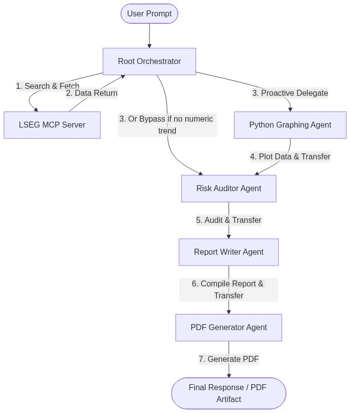
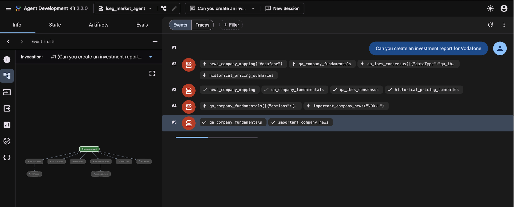
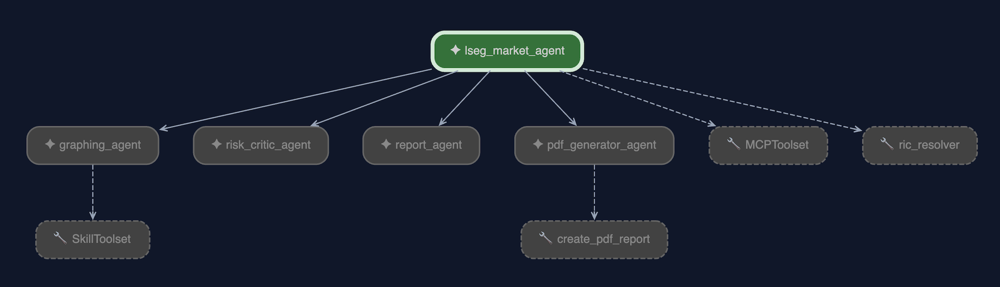
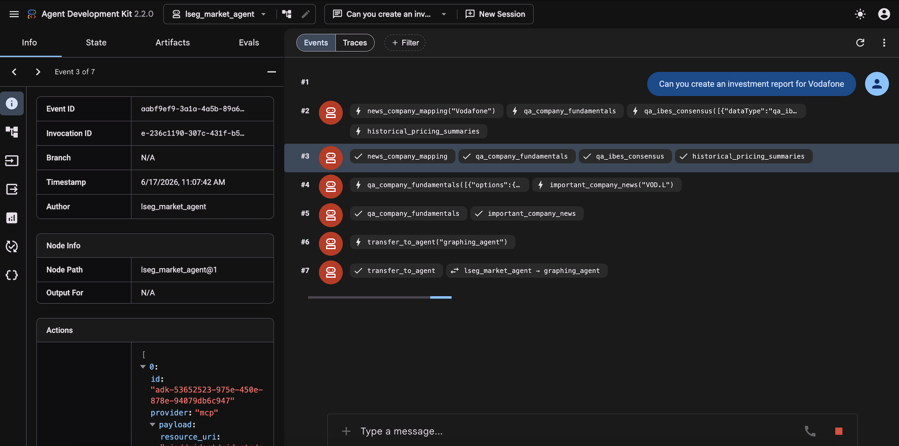
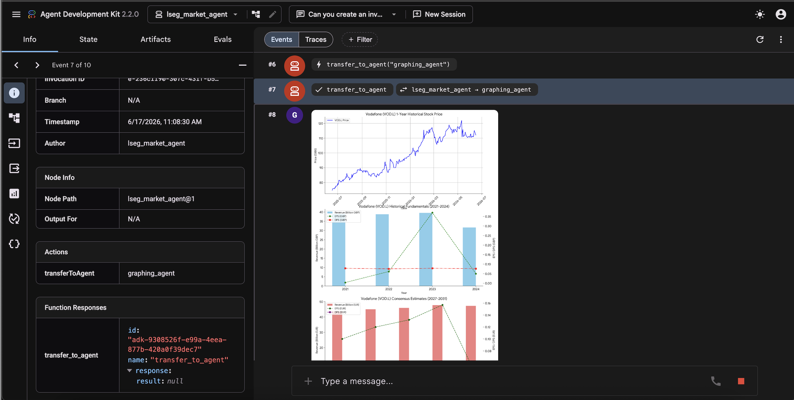
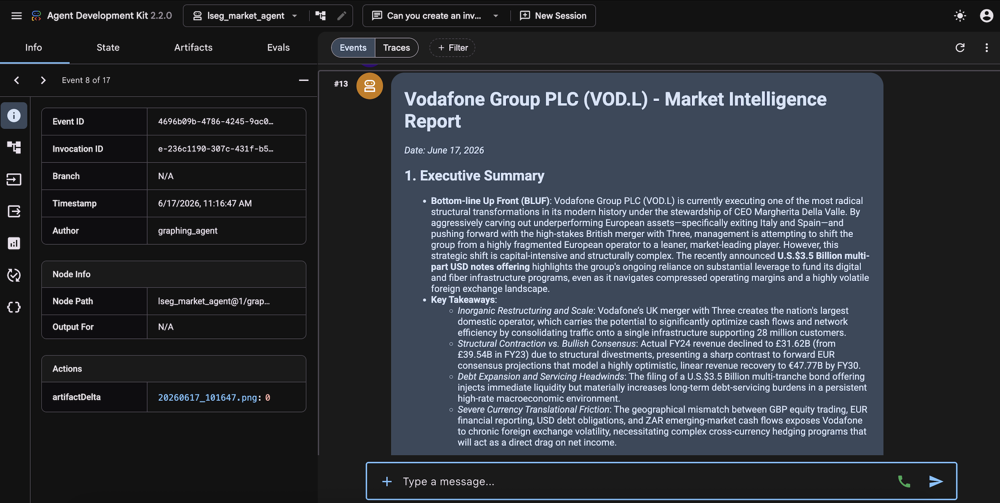
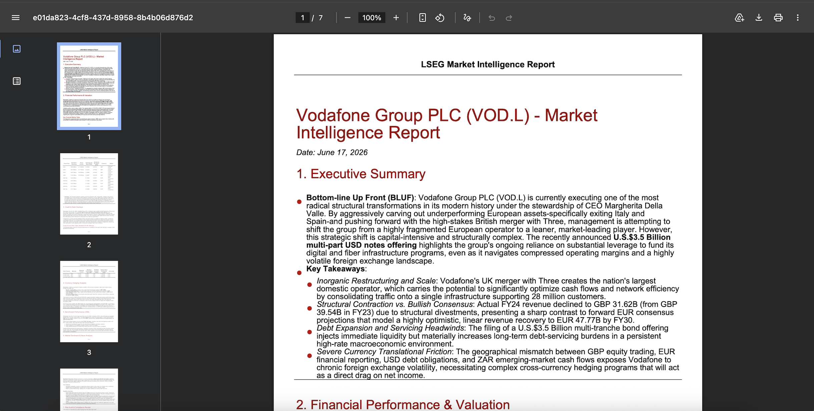
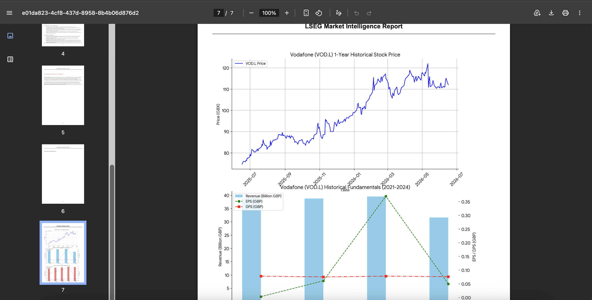

# Unlocking LSEG Data: Build Custom Financial Agents in Gemini Enterprise with LSEG MCP

**Authors: Google Cloud & London Stock Exchange Group (LSEG)**  
**Target Audience: Enterprise Architects, CTO, Financial Technology (FinTech) Practitioners, Quants, Agentic Coders**  

---

## The Fragmented Financial Analyst Workflow

In the fast-paced world of modern finance, investment banking analysts, quants, portfolio managers, and CTOs share a common operational pain point: extreme workflow fragmentation. To formulate a single investment thesis or risk-hedged cross-asset strategy, analysts typically spend hours manually pulling historical balance sheets, extracting forward consensus targets, mapping volatility curves, retrieving news sentiment, and auditing data across siloed systems. Finally, they must manually format these insights into presentation-ready reports and charts.

According to benchmarking studies by the **Association for Financial Professionals (AFP)** and **APQC**, financial planning and analysis (FP&A) professionals spend **only 25% of their time** on value-added, forward-looking analysis. The remaining **75% of their working hours** is consumed by data gathering (42%) and administering manual processes (33%). In general analytics, the "80/20 rule" holds true: analysts spend up to 80% of their time preparing, cleaning, and formatting data, leaving only 20% for modeling and generating insights.

This manual context-switching is slow, error-prone, and impossible to scale. Traditional AI models often fail to help because they lack real-time access to institutional-grade databases, struggle with complex financial math, and cannot execute code or generate compliant visualizations in a secure, audited fashion.

Recently, Google Cloud and LSEG announced a strategic collaboration to integrate LSEG’s trusted, licensed financial data and analytical models directly into **Gemini Enterprise** via a new **Model Context Protocol (MCP)** connector (see the [LSEG and Google Cloud Partnership Announcement](https://www.lseg.com/en/solutions/ai-finance-solutions/google-cloud)). As a reference example of how organizations can build custom agentic workflows on top of this integration, we have developed the **Cross-Asset Market Intelligence & Valuation Agent**. Built on the **Google Agent Development Kit (ADK)** and running on the **Gemini Enterprise Agent Platform**, this reference system demonstrates how enterprise-grade AI agents can perform the quantitative heavy lifting—from data gathering and visual graphing to compliance auditing and publishing—in a matter of seconds.

---

## The Convergence of Model Context Protocol (MCP) and Multi-Agent Orchestration

We are at the absolute cutting edge of the current AI wave. The industry is rapidly shifting from single-turn, stateless LLM chats to orchestrating networks of specialized autonomous agents. Two technologies are driving this shift:

1. **Model Context Protocol (MCP)**: An open standard that enables LLMs to securely and dynamically discover, query, and interact with external data sources and API tools. By exposing LSEG’s institutional market data through MCP, we allow the AI agent to dynamically retrieve anything from options pricing and yield curves to macroeconomic indicators and real-time news.
2. **Google Agent Development Kit (ADK)**: A robust framework designed to coordinate multiple specialized AI agents, enforce state transitions, execute code in secure sandboxes, and expose agents as reusable network services.

By running these components on the **Gemini Enterprise Agent Platform**, organizations benefit from enterprise-grade security, built-in telemetry, and a fully managed runtime environment optimized for high-performance reasoning. This positioning reinforces Google Cloud as an opinionated leader in advanced AI engineering.

---

## Architectural Blueprint: The Multi-Agent Collaboration Engine

Instead of relying on a single large language model to handle data gathering, math reasoning, chart rendering, and report writing, we orchestrate a collaborative team of five specialized agents. Each agent has a distinct role, clear operational constraints, and a strict **Chain of Custody**:



### The Specialized Agent Roles:

1. **The Root Orchestrator (`lseg_market_agent`)**: The cognitive engine of the pipeline. It resolves ambiguous company names to official stock RIC (Reuters Instrument Code) symbols using a dedicated search agent, queries the LSEG tools, and orchestrates the routing of the conversation.
2. **The Python Graphing Agent (`graphing_agent`)**: Equipped with a secure, sandboxed Python code execution environment (`BuiltInCodeExecutor`), this agent dynamically writes and runs code to plot financial data (pandas, matplotlib, mplfinance).
3. **The Risk Auditor Agent (`risk_critic_agent`)**: Compliance and risk auditing are non-negotiable in institutional finance. This agent critiques the gathered data, checking for downside risks, macroeconomic headwinds, and over-optimism relative to historical metrics.
4. **The Report Writer Agent (`report_agent`)**: Synthesizes the quantitative data, news sentiment, visual inferences, and risk audits into a comprehensive, publication-grade Markdown report.
5. **The PDF Generator Agent (`pdf_generator_agent`)**: Automatically compiles the markdown report and any generated visualization PNGs into a beautiful, downloadable PDF.

---

## Deep Dive: Agent Design & Orchestration Code

For technical practitioners and agentic coders, the core value of the Google ADK lies in its ability to declare agents with clean boundaries, specialized instructions, and distinct tool capabilities. Let's look at how the Cross-Asset Market Intelligence & Valuation Agent is structured under the hood in `agent.py`.

### 1. Declaring the Specialized Graphing Agent with Skills

The Graphing Agent is equipped with a sandboxed Python execution context using ADK's `BuiltInCodeExecutor`. To improve its decision-making, it has been enhanced with a dynamic **Skill** for visual planning.

```python
from google.adk.agents import LlmAgent
from google.adk.code_executors import BuiltInCodeExecutor
from google.adk.models import google_llm
from google.adk.skills import load_skill_from_dir
from google.adk.tools import skill_toolset
import pathlib

# Initialize the Gemini model for quantitative/graphing logic
model31 = google_llm.Gemini(model=config.gemini31_model)

# Load the visualization planning skill (following agentskills.io format)
visualization_skill = load_skill_from_dir(
    pathlib.Path(__file__).parent / "skills" / "visualization-planning"
)

# Register the skill inside a SkillToolset
my_skill_toolset = skill_toolset.SkillToolset(
    skills=[visualization_skill],
)

GRAPHING_AGENT_INSTRUCTIONS = """You are a Data Visualization and Graphing Agent.
You are equipped with a Python code execution environment.
When you receive instructions along with numerical data, write a Python script (using libraries like matplotlib, pandas, or mplfinance) to plot the data.
...
ROUTING INSTRUCTION:
1. First, write and execute your Python code to draw the graph.
2. Once the code execution completes and the graph is generated, in your very next response, you MUST call the `transfer_to_agent` tool to transfer execution to `risk_critic_agent`.
"""

graphing_agent = LlmAgent(
    name="graphing_agent",
    description="Draws financial graphs, plots, and visualizes data using python.",
    model=model31,
    instruction=GRAPHING_AGENT_INSTRUCTIONS,
    tools=[
        my_skill_toolset,
    ],
    code_executor=BuiltInCodeExecutor()
)
```

By supplying `code_executor=BuiltInCodeExecutor()`, the ADK automatically registers a code interpreter capability for the agent. The agent writes standard Python blocks, executes them locally in a secure sandbox, inspects standard output, and preserves generated image outputs.

### Enhancing Agents with Skills (`agentskills.io` Patterns)

A major challenge in building reliable financial agents is teaching them domain-specific heuristics—such as mapping analytical intent to the appropriate chart type—without cluttering the core system instructions. System prompts have a limited context window, and overloading them with layout guidelines or plotting rules reduces overall reasoning capability.

The Google ADK solves this by implementing the **Agent Skills pattern** (standardized at [agentskills.io](https://agentskills.io/)). A "Skill" is a structured markdown document (with a YAML frontmatter header) that provides specialized guidance for a specific task. During execution, the ADK dynamic runtime loads the skill file and registers it inside a `SkillToolset`. The LLM can then refer to the skill dynamically as a tool when it needs guidance on how to perform its specialized task.

Let's look at the skill file structure under `skills/visualization-planning/skill.md`:

```markdown
---
name: visualization-planning
description: Visualization planning guidance for matching analytical intent to chart types.
version: 1.0.0
agent_name: graphing_agent
---

# Visualization Planning Guidance

Choose the chart type that best clarifies the analytical intent and minimizes cognitive load:
| Analytical Intent       | Suggested Chart Type    | Key Features             |
| ----------------------- | ----------------------- | ------------------------ |
| Trend inflection        | Candlestick with volume | Annotate support/res     |
| Price vs. fundamentals  | Multi-line with events  | Overlay news on price    |
| Option positioning      | 2D/3D Greeks surfaces   | Delta/gamma strikes      |
...
```

By mounting `my_skill_toolset` containing this skill to the `graphing_agent`, the agent no longer has to guess how to visualize Microsoft's volatility surface or a corporate bond's yield curve. It consults the skill to determine the best visual layout (e.g. 3D surface plot or candlestick overlay) and then writes correct, optimized Python code inside the sandbox.


### 2. Structuring the Root Orchestrator and Agent Delegation

The Root Orchestrator binds the entire multi-agent network together. It directly holds the LSEG MCP toolset, can resolve corporate names using a nested RIC resolver, and lists all other specialized agents as its `sub_agents`.

```python
from google.adk.tools import AgentTool

# Define the root orchestrator's system instructions
AGENT_INSTRUCTIONS = """You are a highly capable Cross-Asset Market Intelligence & Valuation Agent for LSEG.
Your objective is to provide a comprehensive, multi-modal analysis of companies, macroeconomic conditions, fixed income, FX, and indices by synthesizing data from the LSEG MCP server (which offers a complete suite of 37 tools).

When the user asks you to analyze a company or market condition, you should act as an Orchestrator:
1. Proactively gather information from AT LEAST THREE tools relevant to the domain (e.g. Fundamentals, Forward Estimates, and News Headlines for Equities; yield curves, risk analytics, and credit curves for Fixed Income).
2. For news, summarize the exact facts mentioned in the headlines - do not hallucinate outside info.
3. Always cite the specific metrics and news stories retrieved. 
4. **Proactive Visualization**: Even if the user DOES NOT explicitly ask for a graph, you should analyze the gathered data. If a visualization would make the final answer or report more appealing, you MUST delegate the rendering to your `graphing_agent` subagent.
5. If the user requests a comprehensive report and no graphs are needed or they are already complete, you MUST transfer the gathered context directly to `risk_critic_agent` first to secure a risk compliance audit.
"""

# The Root Orchestrator coordinates the workflow and sub-agents
root_agent = LlmAgent(
    name="lseg_market_agent",
    model=model,
    instruction=AGENT_INSTRUCTIONS,
    tools=[
        mcp_client_bridge.create_lseg_mcp_toolset(), 
        AgentTool(ric_resolver_agent)
    ],
    sub_agents=[
        graphing_agent, 
        risk_critic_agent, 
        report_agent, 
        pdf_generator_agent
    ]
)
```

### 3. Orchestration and Chain of Custody Routing

How does the orchestrator route the execution flow? Instead of writing hardcoded Python logic for agent state transitions, the ADK enables the orchestrator and sub-agents to use **system instructions** and dynamic tool-calling (via the `transfer_to_agent` tool) to manage execution handoffs. 

For example, the Root Orchestrator's system instruction dictates:
* Gather LSEG data first.
* If visualizable trends exist, delegate to `graphing_agent`.
* Otherwise, hand over to `risk_critic_agent` to audit downside risks.

Once the `graphing_agent` runs its Python plot script, it invokes `transfer_to_agent("risk_critic_agent")` automatically. The risk auditor completes its critique, and then transfers to `report_agent`, which in turn passes the markdown context to `pdf_generator_agent` to compile the final PDF. This creates a fully audited, linear chain of custody ensuring that every report contains proper downside audits and required visualizations.

---

## Technical Deep Dive: Natively Bridging LSEG MCP & Gemini Enterprise

A key engineering highlight is how natively Google ADK integrates with LSEG’s remote HTTP MCP endpoint. Rather than using standard stdio process proxies, the system establishes a secure HTTP bridge that handles authentication, caching, and token refresh:

```python
# Natively creating the authenticated LSEG MCP connection using ADK
from google.adk.tools.mcp_tool.mcp_session_manager import StreamableHTTPConnectionParams
from google.adk.tools.mcp_tool.mcp_toolset import MCPToolset

def create_lseg_mcp_toolset() -> MCPToolset:
    return MCPToolset(
        connection_params=StreamableHTTPConnectionParams(
            url="https://api.analytics.lseg.com/lfa/mcp",
            headers={},
            timeout=180.0 # 3 minutes for long-running quantitative requests
        ),
        header_provider=lseg_header_provider
    )
```

### Ephemeral JWT Token Refresh
To secure institutional data, the client bridge (`mcp_client_bridge.py`) implements OAuth2 client-credentials logic, securely caching and dynamically refreshing the ephemeral JWT token in the background:

```python
# Automatic JWT token fetch and refresh mechanism
def get_lseg_token() -> str:
    global _LSEG_TOKEN_CACHE
    current_time = time.time()
    
    # Check if cached token is still valid (60-second buffer)
    if _LSEG_TOKEN_CACHE["access_token"] and current_time + 60 < _LSEG_TOKEN_CACHE["expires_at"]:
        return _LSEG_TOKEN_CACHE["access_token"]
        
    client_id = os.getenv("LSEG_CLIENT_ID")
    client_secret = os.getenv("LSEG_CLIENT_SECRET")
    
    url = "https://login.ciam.refinitiv.com/as/token.oauth2"
    headers = {"Content-Type": "application/x-www-form-urlencoded"}
    data = {
        "grant_type": "client_credentials",
        "client_id": client_id,
        "client_secret": client_secret,
        "scope": "lfa"
    }
    
    response = requests.post(url, headers=headers, data=data)
    response.raise_for_status()
    
    res_json = response.json()
    token = res_json.get("access_token")
    expires_in = res_json.get("expires_in", 7200) # Default to 2 hours
    
    _LSEG_TOKEN_CACHE["access_token"] = token
    _LSEG_TOKEN_CACHE["expires_at"] = current_time + expires_in
    return token
```

### Runtime Schema Discovery
During initialization, the ADK automatically reads the structured JSON schemas exposed by LSEG's MCP discovery phase. This registers LSEG's **37 specialized financial tools** as function calls for Gemini, spanning:
- **Equity Research**: Fundamentals (`qa_company_fundamentals`), analyst consensus (`qa_ibes_consensus`), news headlines (`insight_headlines`), historical pricing, and options pricing (`option_value`).
- **Fixed Income**: Yield curves (`interest_rate_curve`), credit default curves (`credit_curve`), bond reference metadata, and risk analytics.
- **FX & Macro**: FX spot prices, forward curves, event trackers, and macroeconomic indicators (`qa_macroeconomic`).

---

## Proactive Visualization & Chain of Custody

This agent goes beyond basic prompt-and-response. It features two advanced behavioral patterns designed for institutional-grade reliability:

### 1. Proactive Visualization
The Root Orchestrator does not wait for an explicit command to draw a chart. Instead, it inspects the dataset size and shape of the retrieved LSEG data. If it detects multi-period quantitative trends (such as a 3-year EPS timeseries, a government yield curve, or index return comparisons), it autonomously instructs the `graphing_agent` to spin up a sandboxed Python execution context, run matplotlib/pandas code, and generate a chart image.

### 2. Audit Before Authoring (Chain of Custody)
To prevent AI hallucinations or over-optimistic reports, the pipeline enforces a strict rule: the Report Writer cannot publish a report unless it has been passed through the Risk Critic first. The Risk Critic audits the data for over-optimism and downside risks, and suggests hedging strategies (such as protective puts or options overlays) which are then embedded as a core compliance section in the final report.

---

## Interactive Demonstration: Walkthrough in the ADK Playground

To see how the Cross-Asset Market Intelligence & Valuation Agent coordinates these processes in real time, let's walk through an execution trace in the **Agent Development Kit (ADK) Playground**. The playground provides a local web-based interface to chat with the agent, inspect active memory, track multi-agent routing, and view tool invocations.

For this walkthrough, the user submits the high-level prompt:
> **"Can you create an investment report for Vodafone"**

Here is how the multi-agent system steps through this request:

### Step 1: Initial Discovery & Multi-Tool Execution
Upon receiving the prompt, the **Root Orchestrator (`lseg_market_agent`)** automatically maps the request to its LSEG MCP toolset. It calls four tools in parallel to build rich financial context:
* Resolves "Vodafone" to the Reuters Instrument Code **`VOD.L`** using `news_company_mapping`.
* Fetches historical balance sheets and margins using `qa_company_fundamentals`.
* Extracts forward estimates using `qa_ibes_consensus`.
* Retrieves the recent price trend via `historical_pricing_summaries`.



### Step 2: Multi-Agent Hierarchy & Topology
The ADK UI visualizes the topology of our multi-agent team. In the graph view, we can see the root node `lseg_market_agent` managing its four sub-agents (`graphing_agent`, `risk_critic_agent`, `report_agent`, `pdf_generator_agent`) and its associated toolsets:



### Step 3: Handoff to the Graphing Sub-Agent
Because the orchestrator has retrieved multi-period financial fundamentals, consensus estimates, and price histories, its system instructions trigger a proactive visualization. The orchestrator calls the `transfer_to_agent` tool to hand off the execution state to the **Python Graphing Agent**:



### Step 4: Proactive Visualization in the Python Sandbox
The `graphing_agent` receives the dataset, consults its visualization planning skill, writes a Python script, and runs it within its secure, sandboxed execution environment. The output—a high-fidelity dashboard containing three subplots showing historical prices, historical fundamentals, and analyst consensus forecasts—is rendered directly in the playground chat window:



### Step 5: Auditing and Generating the Research Report
Following the visual plotting, the execution flow is routed through the **Risk Auditor (`risk_critic_agent`)** to compile compliance overlays. The context is then handed off to the **Report Writer (`report_agent`)**, which synthesizes all quantitative details, news sentiment, and compliance notes into a comprehensive, multi-section Markdown document:



### Step 6: Compilation into the Final PDF Report
Lastly, the **PDF Generator (`pdf_generator_agent`)** receives the markdown text along with the file path of the generated dashboard image. It runs a custom fpdf compilation script to generate a beautifully styled PDF:



The dashboard charts are appended to the appendix at the end of the report, creating a professional, institutional-ready PDF document:



---

## Enterprise Access & Sharing: ADK, Gemini Enterprise & Agent Platform

In modern enterprise architectures, AI agents cannot exist in isolated silos. For true organizational agility, agents must be easily discoverable, securely accessible, and seamlessly shareable across network boundaries and business units. 

The **Google ADK**, **Gemini Enterprise**, and **Gemini Enterprise Agent Platform** form a complete end-to-end access and sharing environment for agents. Leveraging the **Agent-to-Agent (A2A) protocol**, organizations can expose specialized agents (like our LSEG Market Intelligence Agent) as reusable network utilities, enabling cross-team collaboration, zero-trust delegation, and seamless multi-agent sharing.

### 1. Publishing and Sharing Agents via the Agent Card (A2A)
Using the ADK's `to_a2a` wrapper, we can immediately turn our LSEG agent into an A2A-compliant network microservice:

```python
from google.adk.a2a.utils.agent_to_a2a import to_a2a
from lseg_market_agent.agent import root_agent

# Package and expose the root agent as an A2A compliant service
a2a_app = to_a2a(root_agent, port=8001)
```

When hosted within the **Gemini Enterprise Agent Platform**, this service automatically publishes a standardized, machine-readable **Agent Card** at its `/.well-known/agent.json` endpoint. The Agent Card serves as a formal contract—sharing the agent's description, schema inputs, capabilities, and tools with the rest of the corporate ecosystem.

### 2. Discovering and Accessing Shared Agents Across the Network
Because the Gemini Enterprise Agent Platform provides a unified registry and discovery surface, another team's agent (such as an Automated M&A Auditor or a Portfolio Rebalancing Bot) can search the directory, locate the LSEG Market Agent, and consume it natively using the ADK's `RemoteA2aAgent` client bridge:

```python
from google.adk.agents import RemoteA2aAgent, LlmAgent

# 1. Access the shared LSEG agent over the network using its Agent Card URL
lseg_remote_service = RemoteA2aAgent(
    name="lseg_market_intelligence",
    agent_card_url="https://lseg-agent-service.internal/.well-known/agent.json"
)

# 2. Register it as a shared tool inside another custom agent
portfolio_manager_agent = LlmAgent(
    name="portfolio_orchestrator",
    instruction="Assess risk of current holdings. Delegate deep market/asset research to the lseg_market_intelligence service.",
    sub_agents=[lseg_remote_service]
)
```

### 3. Benefits of the Shared Agent Environment
*   **Secure Zero-Trust Boundaries**: The client agent only interacts with the boundaries defined in the shared agent's card, preventing unauthorized code execution or direct database access.
*   **Cross-Language / Cross-Framework Sharing**: An agent written in Python using ADK can be accessed and utilized by agents running in completely different language environments or orchestrators, provided they communicate via the standard A2A HTTP contract.
*   **Scalable Collaboration**: By decentralizing specialized skills (e.g. data fetching from LSEG, graphing, math auditing), enterprise architectures remain clean, modular, and maintainable.

---

## Why Gemini Enterprise Agent Platform is the Best Place to Host & Run Agents

Developing high-performance financial agents requires more than just an orchestration library; it requires a robust runtime, hosting, and auditing platform. **Gemini Enterprise Agent Platform** serves as the ultimate environment for executing, monitoring, and scaling these shared assets:

*   **Vertex AI Agent Engine (Reasoning Engine)**: Deploy the agent to the cloud with a single command:
    ```bash
    agents-cli deploy --project="YOUR_PROJECT_ID" --region="us-central1"
    ```
    This automatically packages your code, registers it as a Vertex AI Reasoning Engine, and scales the resources needed to run it.
*   **The Quality Flywheel (ADK Evals)**: Continuously evaluate your agents' performance using programmatic metrics. We define eval datasets (e.g., `tests/eval/datasets/lseg_market_evals.json`) that check if the model selects the correct tools and successfully completes complex multi-turn tasks.
    Run evals instantly:
    ```bash
    agents-cli eval run
    ```
    By combining evaluations, traces, and optimization, you can ensure your financial agent stays compliant and accurate as underlying models evolve.

---

## Conclusion & Call to Action

The Cross-Asset Market Intelligence Agent shows that when you combine Gemini Enterprise with LSEG's institutional data ecosystem via the Model Context Protocol, the result is a massive leap forward in operational efficiency. We eliminate manual context-switching, secure rigorous risk auditing, and automate visual publication.

**Empower your analysts with institutional-grade AI collaboration using Gemini Enterprise. Position Gemini Enterprise Agent Platform as the best place to run agents.**

*Get started today by checking out the LSEG MCP demo codebase, configuring your credentials, and deploying your first collaborative multi-agent workflow on Gemini Enterprise.*

---

## References

1. **LSEG and Google Cloud AI Solutions Partnership**: [LSEG and Google Cloud Partnership Announcement](https://www.lseg.com/en/solutions/ai-finance-solutions/google-cloud)
2. **Association for Financial Professionals (AFP) FP&A Benchmarks**: [Vena Solutions FP&A Industry Time Allocation Study](https://www.venasolutions.com/)
3. **Data Preparation Productivity Statistics**: Forbes & Anaconda, *"The 80/20 Rule of Data Munging"* / APQC, *"Manual Data Preparation and Processing in Corporate Finance"*

